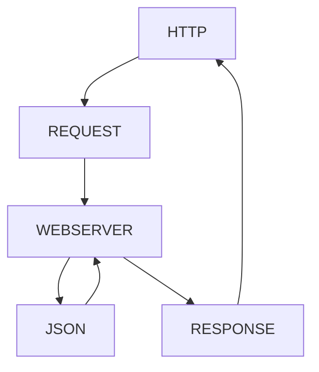

<h1>API REST #FRUTAS</h1>

- [EJEMPLOS DE USO](#ejemplos-de-uso)
- [GET](#get)
    - [GET POR NOMBRE](#get-por-nombre)
    - [GET POR PRECIO](#get-por-precio)
- [POST](#post)
- [PUT](#put)
- [DELETE](#delete)
- [.env](#env)


|MÉTODO|URL|DESCRIPCION|
|-|-|-|
|GET|http://localhost:3008/|La URL o ruta principal
|GET| http://localhost:3008/frutas | La URL general para visualizar todos los productos
|GET| http://localhost:3008/frutas/nombre/:nombre | La URL que nos retorna un producto por su nombre
|GET| http://localhost:3008/frutas/importe/:importe | La URL que nos retorna un producto por su precio aproximado
|POST| http://localhost:3008/frutas/ | La URL que nos permite dar de alta un recurso
|PUT| http://localhost:3008/frutas/:id | La URL que nos permite modificar un recurso existente
|PUT| http://localhost:3008/frutas/:id | La URL que nos permite eliminar un recurso existente

## EJEMPLOS DE USO
## GET
http://localhost:3008/frutas



#### GET POR NOMBRE
http://localhost:3008/frutas/nombre/Coco
#### GET POR PRECIO
http://localhost:3008/frutas/precio/500
## POST
http://localhost:3008/frutas

Cuerpo
```javascript
{
    "id":22,
    "imagen": "🐉",
    "nombre": "Mandarinas",
    "importe": 800,
    "stock": 20
}
```
## PUT
http://localhost:3008/frutas/2

Cuerpo
```javascript
{
    "imagen": "🐉",
    "nombre": "Mandarinas",
    "importe": 1100,
    "stock": 50
}
```
## DELETE
http://localhost:3008/frutas/2

## .env
Deberás crear en tu carpeta raíz un archivo con nombre ".env" donde incluirás las siguientes variables:
```javascript
PORT=3008
DATABASE_PATH=/database/frutas.json
```
